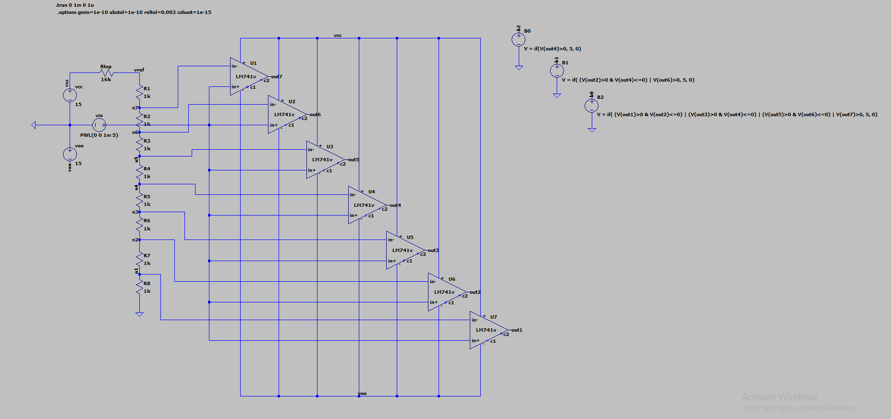
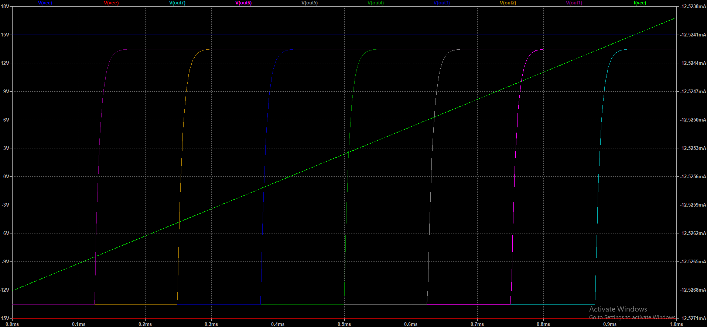
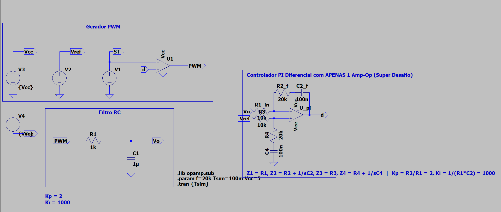
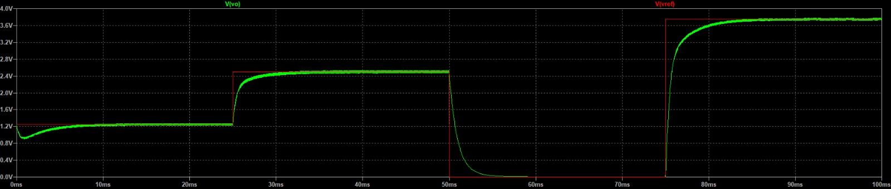

# SEL0345 – Instrumentação Eletrônica I

Repositório com os projetos práticos de modelagem, dimensionamento analítico e simulação SPICE desenvolvidos para a disciplina **SEL0345 – Instrumentação Eletrônica I**, do Departamento de Engenharia Elétrica e de Computação da Escola de Engenharia de São Carlos, Universidade de São Paulo (**EESC-USP**).

Docente: Prof. Dr. Stefan Thiago Cury Alves dos Santos  
Discentes: Eduardo Maia de Oliveira e Eduardo Yumoto Carvalheira  

---

## Estrutura do Repositório

```text
├── README.md                       # Documentação geral do repositório
├── .gitignore                      # Regras globais de exclusão do Git
│
├── atividade1/                     # Atividade 1: Conversor ADC Flash de 3 Bits
│   ├── README.md                   # Documentação detalhada da Atividade 1
│   ├── .gitignore                  # Regras de exclusão locais
│   ├── lm741_schematic.asc         # Esquemático principal no LTspice
│   ├── 741.lib                     # Modelo SPICE do amplificador LM741
│   ├── schematic_versaofinal.png   # Diagrama esquemático completo
│   ├── graficos_versaofinal.png    # Formas de onda da quantização
│   ├── lib/                        # Símbolos customizados necessários
│   └── docs/                       # Memórias de cálculo e relatórios de etapas
│
└── atividade2/                     # Atividade 2: Controlador PI Analógico via PWM
    ├── README.md                   # Documentação detalhada da Atividade 2
    ├── .gitignore                  # Regras de exclusão locais
    ├── PI_alunos.asc               # Esquemático principal (2 Amp-Ops - Desafio)
    ├── PI_alunos_1opamp.asc        # Esquemático diferencial (1 Amp-Op)
    ├── PI_alunos_4opamp.asc        # Esquemático canônico (4 Amp-Ops)
    ├── Atividade_2_Instrumentação.pdf # Relatório técnico final da atividade
    ├── esquematico_controlador_pi.png # Esquemático do relatório
    ├── simulacao_ltspice_relatorio.png # Formas de onda do relatório
    ├── resultado_correto_simulacao.png # Gráfico analítico (2 Amp-Ops)
    ├── resultado_1opamp_simulacao.png  # Gráfico analítico (1 Amp-Op)
    └── resultado_4opamp_simulacao.png  # Gráfico analítico (4 Amp-Ops)
```

---

## Resumo dos Projetos

### [Atividade 1: Conversor Analógico-Digital (ADC) Flash de 3 Bits](atividade1/README.md)
Projeto de um conversor A/D Flash de alta velocidade para digitalização de sinais entre $0\text{ V}$ e $5\text{ V}$, com resolução de 3 bits ($8$ níveis, $V_{LSB} = 0{,}625\text{ V}$).

- **Escada Resistiva (R-Ladder):** 8 resistores em série de $1\text{ k}\Omega$ gerando 7 limiares de tensão de referência.
- **Banco de Comparadores:** 7 amplificadores operacionais LM741 em malha aberta gerando código termômetro.
- **Codificador de Prioridade:** Lógica combinacional sintetizada para conversão em palavras binárias TTL ($B_2, B_1, B_0$).




Consulte a documentação completa em [`atividade1/README.md`](atividade1/README.md).

---

### [Atividade 2: Controlador PI Analógico para Circuito RC via PWM](atividade2/README.md)
Projeto e sintonia de um controlador analógico Proporcional-Integral ($K_p = 2$, $K_i = 1000\text{ s}^{-1}$) para regulação de tensão sobre um capacitor em circuito excitado por modulação por largura de pulso (PWM de $20\text{ kHz}$).

O projeto contempla três implementações funcionais:
- **Topologia de 4 Amp-Ops:** Implementação modular canônica (Subtrator + Bloco P + Bloco I + Somador).
- **Topologia de 2 Amp-Ops (Desafio):** Fusão das ações de ganho, integração e soma no terra virtual do segundo amp-op.
- **Topologia de 1 Amp-Op (Super Desafio):** Amplificador diferencial com casamento de impedâncias complexas ($Z_1$ a $Z_4$).




Consulte a documentação completa em [`atividade2/README.md`](atividade2/README.md).

---

## Requisitos de Software

- **LTspice XVII** ou **LTspice 24+** (Analog Devices).
- Não requer pacotes externos; todos os subcircuitos e arquivos de modelo `.lib` e `.asy` estão contidos neste repositório.

---

## Como Executar as Simulações

1. Clone o repositório:
   ```bash
   git clone https://github.com/SEU_USUARIO/NOME_DO_REPOSITORIO.git
   cd NOME_DO_REPOSITORIO
   ```
2. Abra os arquivos `.asc` desejados dentro de `atividade1/` ou `atividade2/` no LTspice.
3. Pressione o botão **Run** para reproduzir as formas de onda apresentadas nas documentações.
