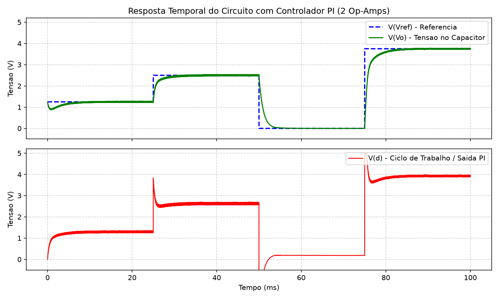

# Projeto de Controlador PI Analógico para Circuito RC via PWM

Repositório contendo o projeto, dimensionamento analítico e validação em simulação SPICE de um controlador Proporcional-Integral (PI) analógico implementado com amplificadores operacionais. O sistema controla em malha fechada a tensão sobre um capacitor excitado por modulação por largura de pulso (PWM).

---

## 1. Visão Geral do Sistema

O sistema de controle opera em malha fechada para regular a tensão de saída $V_o$ de um filtro passa-baixas RC de primeira ordem, seguindo degraus de tensão de referência $V_{ref}$.

```
                  +------------------------------------------------+
                  |               Controlador PI                   |
                  |                                                |
Vref ---> (+) --->| Erro = Vref - Vo ---> Ação PI ---> Sinal d --->|---> Gerador PWM ---> Circuito RC ---> Vo
           ^ -    +------------------------------------------------+        (20 kHz)       (R=1k, C=1uF)     |
           |                                                                                                 |
           +-------------------------------- Realimentação -------------------------------------------------+
```

### Especificações do Projeto

| Parâmetro | Descrição | Valor / Expressão |
| :--- | :--- | :--- |
| $K_p$ | Ganho proporcional | $2{,}0$ |
| $K_i$ | Ganho integral | $1000\text{ s}^{-1}$ |
| $f_{PWM}$ | Frequência da portadora dente de serra | $20\text{ kHz}$ ($T = 50\ \mu\text{s}$) |
| $V_{cc} / V_{ee}$ | Barramentos de alimentação | $+5\text{ V} / -5\text{ V}$ |
| Filtro RC | Planta de primeira ordem | $R_1 = 1\text{ k}\Omega$, $C_1 = 1\ \mu\text{F}$ ($\tau = 1\text{ ms}$) |
| Função do Controlador | Domínio de Laplace | $C(s) = K_p + \frac{K_i}{s} = 2 + \frac{1000}{s}$ |

---

## 2. Diagrama Esquemático

O circuito completo implementado no LTspice integra o modulador PWM (gerador dente de serra + comparador $U_1$), a planta RC ($R_1$, $C_1$) e o controlador PI em malha fechada:


---

## 3. Topologias Implementadas

O projeto foi desenvolvido e comparado em três níveis de integração circuital:

### Topologia A: 4 Amplificadores Operacionais (Canônica)
Implementação modular baseada no diagrama de blocos clássico:
1. **Subtrator Diferencial ($U_{sub}$):** Computa $Erro = V_{ref} - V_o$ com resistores casados de $10\text{ k}\Omega$.
2. **Amplificador Inversor Proporcional ($U_{prop}$):** Ganho $A_v = -R_{f\_p} / R_{in\_p} = -20\text{ k}\Omega / 10\text{ k}\Omega = -2$.
3. **Integrador Inversor ($U_{int}$):** Ganho $A_i(s) = -1 / (s \cdot R_{in\_i} \cdot C_{f\_i}) = -1 / (s \cdot 10\text{ k}\Omega \cdot 100\text{ nF}) = -1000/s$.
4. **Somador Inversor ($U_{sum}$):** Recombina os sinais com inversão de fase unitária:
   $$d(s) = -(V_{prop} + V_{int}) = \left(2 + \frac{1000}{s}\right) \cdot Erro(s)$$

Arquivo: [`PI_alunos_4opamp.asc`](PI_alunos_4opamp.asc)

### Topologia B: 2 Amplificadores Operacionais (Otimizada - Desafio)
Redução de estágios através da fusão das ações proporcional, integral e somadora em um único amp-op:
1. **Subtrator Inversor ($U_2$):** Gera $V_{out,U2} = V_o - V_{ref} = -Erro$.
2. **Controlador PI Inversor ($U_3$):** Ramo de entrada $R_6 = 10\text{ k}\Omega$ e realimentação composta por ramo série $R_7 = 20\text{ k}\Omega$ e $C_2 = 100\text{ nF}$:
   $$Z_f(s) = R_7 + \frac{1}{s C_2}$$
   $$d(s) = -\frac{Z_f(s)}{R_6} \cdot (-Erro(s)) = \left(\frac{R_7}{R_6} + \frac{1}{s R_6 C_2}\right) Erro(s) = \left(2 + \frac{1000}{s}\right) Erro(s)$$

Arquivo: [`PI_alunos.asc`](PI_alunos.asc)

### Topologia C: 1 Amplificador Operacional (Diferencial de Impedâncias Casadas)
Implementação com máxima densidade de integração via amplificador diferencial generalizado:
- Entrada inversora alimentada por $V_o$ via $Z_1 = R_1 = 10\text{ k}\Omega$, com realimentação série $Z_2 = R_2 + 1/(sC_2)$ ($20\text{ k}\Omega$, $100\text{ nF}$).
- Entrada não-inversora alimentada por $V_{ref}$ via $Z_3 = R_3 = 10\text{ k}\Omega$, com terminação para terra $Z_4 = R_4 + 1/(sC_4)$ ($20\text{ k}\Omega$, $100\text{ nF}$).
- Sob a condição de balanceamento $Z_3 = Z_1$ e $Z_4 = Z_2$:
  $$d(s) = \frac{Z_2(s)}{Z_1(s)} (V_{ref}(s) - V_o(s)) = \left(\frac{R_2}{R_1} + \frac{1}{s R_1 C_2}\right) Erro(s)$$

Arquivo: [`PI_alunos_1opamp.asc`](PI_alunos_1opamp.asc)

---

## 4. Resultados de Simulação

As simulações transientes foram executadas no LTspice (`.tran 100m`) aplicando uma forma de onda PWL na referência $V_{ref}$ com quatro patamares de amplitude:




### Desempenho em Regime Permanente

| Intervalo de Tempo | $V_{ref}$ | $V_o$ em Regime | Erro Estacionário | Sinal de Controle $d$ |
| :--- | :--- | :--- | :--- | :--- |
| $0\text{ a }25\text{ ms}$ | $1{,}250\text{ V}$ | $1{,}227\text{ V}$ | $< 25\text{ mV}$ | $1{,}34\text{ V}$ |
| $25\text{ a }50\text{ ms}$ | $2{,}500\text{ V}$ | $2{,}470\text{ V}$ | $< 30\text{ mV}$ | $2{,}68\text{ V}$ |
| $50\text{ a }75\text{ ms}$ | $0{,}000\text{ V}$ | $0{,}000\text{ V}$ | $0{,}00\text{ mV}$ | $0{,}18\text{ V}$ |
| $75\text{ a }100\text{ ms}$ | $3{,}750\text{ V}$ | $3{,}734\text{ V}$ | $< 20\text{ mV}$ | $3{,}96\text{ V}$ |

*Nota: O resíduo estacionário inferior a 30 mV decorre da ondulação residual de chaveamento inerente ao filtro RC de primeira ordem submetido ao trem de pulsos PWM de 20 kHz.*

---

## 5. Estrutura do Diretório

```text
atividade2/
├── .gitignore                      # Exclusão de arquivos binários e temporários do LTspice
├── PI_alunos.asc                   # Esquemático principal (2 Amp-Ops - Versão Desafio)
├── PI_alunos_1opamp.asc            # Esquemático (1 Amp-Op - Versão Diferencial)
├── PI_alunos_4opamp.asc            # Esquemático (4 Amp-Ops - Versão Canônica)
├── Atividade_2_Instrumentação.pdf # Relatório técnico final da atividade
├── esquematico_controlador_pi.png # Imagem do diagrama esquemático completo
├── simulacao_ltspice_relatorio.png # Formas de onda da simulação transiente
├── resultado_correto_simulacao.png # Gráfico analítico comparativo (2 Amp-Ops)
├── resultado_1opamp_simulacao.png  # Gráfico analítico (1 Amp-Op)
├── resultado_4opamp_simulacao.png  # Gráfico analítico (4 Amp-Ops)
└── README.md                       # Documentação técnica do projeto
```

---

## 6. Instruções para Execução

1. Abra qualquer um dos esquemáticos (`PI_alunos.asc`, `PI_alunos_4opamp.asc` ou `PI_alunos_1opamp.asc`) no LTspice.
2. Clique em **Simulate -> Run**.
3. Adicione os traços das variáveis de interesse:
   - `V(Vo)`: Tensão regulada sobre o capacitor.
   - `V(Vref)`: Degraus de referência.
   - `V(d)`: Variável analógica de controle do ciclo de trabalho.
